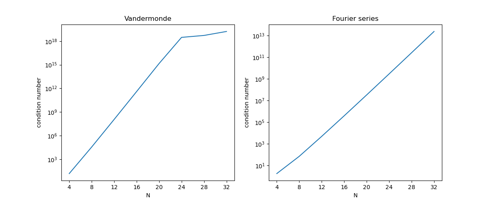
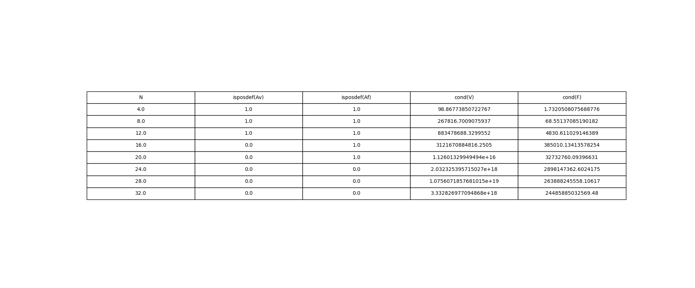
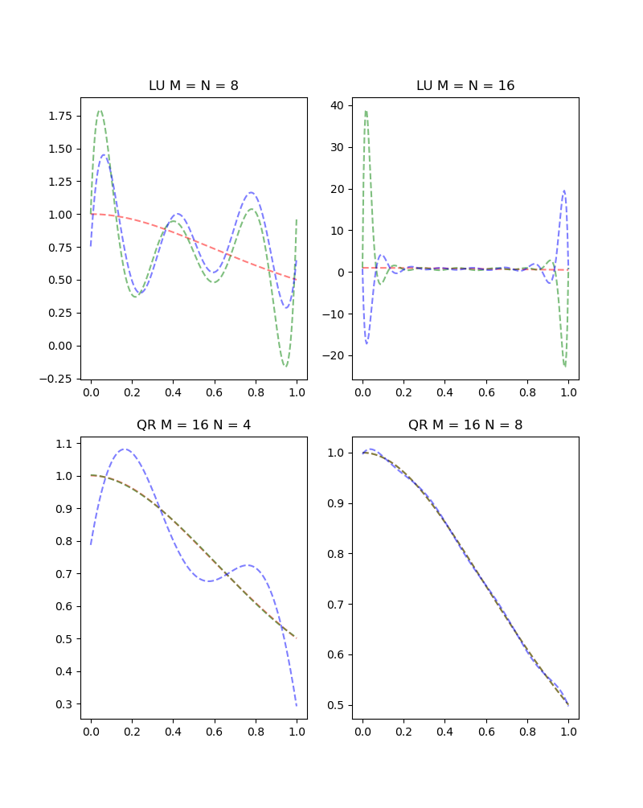

# Assignment 5

## 2 NumPy Warm-up 
### 2.1 (10 points) Choose a few different one-dimensional Gaussian functions (by choosing different mean and variance values), plot them.

&emsp;&emsp;我选择了四条高斯函数曲线，分别是均值为0和1、标准差为1和2

### 2.2 (10 points) Verify the above identity for each Gaussian function.
```
part2_2: the integrals of these 4 Gaussian functions are
0.9973443008306536
0.9973223077808391
0.9973443008306555
0.9973223077808402
```
&emsp;&emsp;经过求四条曲线从 μ - σ * 3 到 μ + σ * 3 的积分可以看出，图像面积为1

## 3 Numerics and Linear Algebra
### 3.1 (25 points) Use an LU solve (scipy.linalg.lu from SciPy package) to estimate the monomial coefficients c. Report the residual L2 norm for both linear systems when N = 8 and N = 16.
&emsp;&emsp;用vandermonde和fourier函数来构造两种矩阵：
```python
def vandermonde(N):
    xis = np.arange(0, 1.001, 1 / (N - 1))
    v1 = np.vander(xis, increasing=True)
    return v1


def fourier(N, M=-1):
    if M == -1:
        M = N

    m = N - 1
    xis = np.arange(0, 1.01, 1 / m)

    ff = []
    for x in xis:
        for i in range(1, M + 1):
            if i <= M / 2:
                ff.append(np.sin(np.pi * i * x))
            else:
                ff.append(np.cos(np.pi * (i - M / 2) * x))

    ff = np.array([ff])
    ff = ff.reshape(N, M)
    return ff
```
&emsp;&emsp;用do_c函数来求范德蒙德和傅里叶矩阵下的c，以及L2范数：
```python
def do_c(N):
    m = N - 1
    xis = []  # 列向量x
    fis = []  # 列向量f
    for i in range(0, N):
        xi = i / m
        fi = f(xi)
        xis.append(xi)
        fis.append(fi)

    van = vandermonde(N)  # 范德蒙德矩阵
    ff = fourier(N)  # F矩阵
    van_p, van_l, van_u = lu(van)
    ff_p, ff_l, ff_u = lu(ff)
    van_c = np.linalg.solve(van_u, np.linalg.solve(van_l, fis))
    ff_c = np.linalg.solve(ff_u, np.linalg.solve(ff_l, fis))

    van_norm = la.norm(np.matmul(van, xis)-fis)
    ff_norm = la.norm(np.matmul(ff, xis)-fis)
    return van_c, ff_c, van_norm, ff_norm
```
&emsp;&emsp;结果：
```
when N = 8
van_c : [ 1.00000000e+00  4.17062913e+01 -6.96422870e+02  4.07116491e+03
 -1.14004573e+04  1.65633688e+04 -1.20297269e+04  3.45034704e+03]
ff_c : [ 1.25946573  7.50388326  0.0125608  -2.13427132 -5.53669891  0.5715248
  5.5825409   0.13647935]
van_norm : 4.157635643795263
ff_norn : 4.103804100707729

when N = 16
van_c : [ 1.00000000e+00  5.39351587e+03 -2.58839425e+05  5.24587537e+06
 -6.04966965e+07  4.48554453e+08 -2.28138795e+09  8.26393577e+09
 -2.17785622e+10  4.21564954e+10 -5.98826802e+10  6.16573475e+10
 -4.47549142e+10  2.17055599e+10 -6.31014333e+09  8.31299146e+08]
ff_c : [-3.32664506e+01 -3.16180714e+04  1.65955455e+02  2.24249288e+04
 -1.18132691e+02 -4.73825802e+03  1.99294173e+01  1.59078874e+02
  2.02303755e+04 -1.08951683e+02 -3.11098089e+04  1.65951898e+02
  1.21026150e+04 -5.97095217e+01 -1.22316003e+03  3.46622709e+00]
van_norm : 8.857592171313605
ff_norn : 8.237097290612189
```

### 3.2 (10 points) Using the numpy.linalg.cond function in NumPy, plot N vs. cond(V) and N vs. cond(F) for N = 4, 6, 8, ...32. Write a couple of sentences explaining the reasons for the trends in these two plots.
&emsp;&emsp;使用log坐标轴对不同N值的范德蒙德矩阵和傅里叶矩阵条件数进行折线图绘制：
```python
def do3_2():
    axes = np.arange(4, 33, 4)
    print("part3_2:")
    print("axes :", axes)

    condV = []
    condF = []
    for x in axes:
        tempV = vandermonde(x-1)
        condV.append(la.cond(tempV))

        tempF = fourier(x)
        condF.append(la.cond(tempF))

    print("cond(V) :", condV)
    print("cond(F) :", condF)
    print("\n")
```

&emsp;&emsp;左图随着N增长先是指数爆炸，而后呈现出稳定状态，可能是因为x的次方较大后，轻微的扰动对结果影响被巨大的结果舍掉了，右图则不断震荡，条件数一直呈现指数爆炸趋势

### 3.3 (15 points)

```
the largest value of N where Av is positive definite : 12
883478688.3299552
the largest value of N where Af is positive definite : 20
32732760.09396631
```
+ 正定矩阵的定义是，对所有非零向量x，有 $x^{T}Ax > 0$ 
+ 这些条件数之间没有关联

### 3.4 (10 points)
```python
def do3_4():
    Av = vandermonde(8)
    Af = fourier(8)

    Lv = np.linalg.cholesky(Av.T @ Av)
    Lf = np.linalg.cholesky(Af.T @ Af)

    # 构造一维向量，作为xi
    a = np.arange(0, 1.001, 1 / 7)

    # 得到对应的函数值，作为f向量
    b = [((1 + x ** 2) ** -1) for x in a]

    yv = np.linalg.solve(Lv, Av.T @ b)
    cv = np.linalg.solve(Lv.T, yv)

    yf = np.linalg.solve(Lf, Af.T @ b)
    cf = np.linalg.solve(Lf.T, yf)
```
&emsp;&emsp;使用Cholesky分解对 N = 8 时的方程求解：
```
vector c of vandermonde is : [ 1.00000000e+00 -1.92981042e-03 -9.64341028e-01 -2.55940760e-01
  1.93414873e+00 -1.83753052e+00  7.29013454e-01 -1.03420064e-01]
verify using np.allclose(V c, b) : True
residual of vandermonde : 3.608904809161406e-22
vector c of fourier series is : [ 1.35488014 -0.04116264 -0.35430384  0.0015691   0.26057558  0.83058785
 -0.01057558 -0.08058785]
verify using np.allclose(V c, b) : True
residual of fourier series : 1.8858706015439813e-30
```
&emsp;&emsp;LU的L2残差要比Cholesky分解小几个数量级


## 4 Least Squares Problems and QR
### 4.1 (15 points) Solve the least square system with QR decomposition(numpy.linalg.qr ()) when M = 16, N = 4, 8
&emsp;&emsp;使用QR分解对方称进行求解：
```python
def qr_vandermonde(N):
    a = np.arange(0, 1.001, 1 / 15)
    # 得到对应的函数值，作为f向量
    b = [((1 + x ** 2) ** -1) for x in a]

    v = np.vander(a, N, increasing=True)

    q, r = np.linalg.qr(v.T @ v)

    y = np.linalg.solve(q, v.T @ b)

    c = np.linalg.solve(r, y)

    print(c)

    return c


def qr_fourier(M):
    a = np.arange(0, 1.001, 1 / 15)

    # 得到对应的函数值，作为f向量
    b = [((1 + x ** 2) ** -1) for x in a]

    f = fourier(16, M)

    q, r = np.linalg.qr(f.T @ f)

    c = np.linalg.inv(r) @ q.T @ f.T @ b
    # c = np.linalg.linalg.inv(r).dot(q.T).dot(b)

    print(c)

    return c
```
&emsp;&emsp;结果：
```
vandermonde 16 X 4 :
[ 1.00166564 -0.02698999 -1.01909544  0.54698731]
vandermonde 16 X 8 :
[ 1.00000188e+00 -1.07143526e-03 -9.75766181e-01 -2.00107712e-01
  1.80128197e+00 -1.67195242e+00  6.25188470e-01 -7.75731067e-02]
fourier series 16 X 4 :
[ 1.23673804 -0.02483006  0.24763933  0.53933343]
fourier series 16 X 8 :
[ 1.35569612 -0.04267561 -0.36313314  0.00197172  0.26167473  0.83497201
 -0.01168661 -0.08810734]
[ 1.00166564 -0.02698999 -1.01909544  0.54698731]
[ 1.23673804 -0.02483006  0.24763933  0.53933343]
[ 1.00000188e+00 -1.07143526e-03 -9.75766181e-01 -2.00107712e-01
  1.80128197e+00 -1.67195242e+00  6.25188470e-01 -7.75731067e-02]
[ 1.35569612 -0.04267561 -0.36313314  0.00197172  0.26167473  0.83497201
 -0.01168661 -0.08810734]
```

### 4.2 (10 points) Plot the gV , gF when M = 16, N = 4, 8, compare them with the analytical function f(x) and the interpolation function obtained in Question 3.1.
&emsp;&emsp;图中三条线为红、绿、蓝，分别表示标准，范德蒙德，傅里叶

&emsp;&emsp;可以看出除了M=16 N=4时的傅里叶曲线，其他曲线的拟合效果(在0，1范围内)都很好