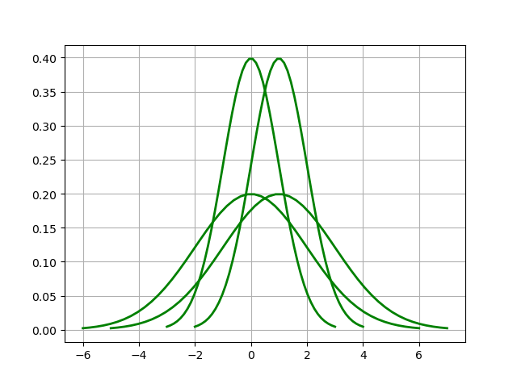

# Assignment 5

## 2 NumPy Warm-up 
### 2.1 (10 points) Choose a few different one-dimensional Gaussian functions (by choosing different mean and variance values), plot them.

### 2.2 (10 points) Verify the above identity for each Gaussian function.
```
0.9973443008306536
0.9973223077808391
0.9973443008306555
0.9973223077808402
```

