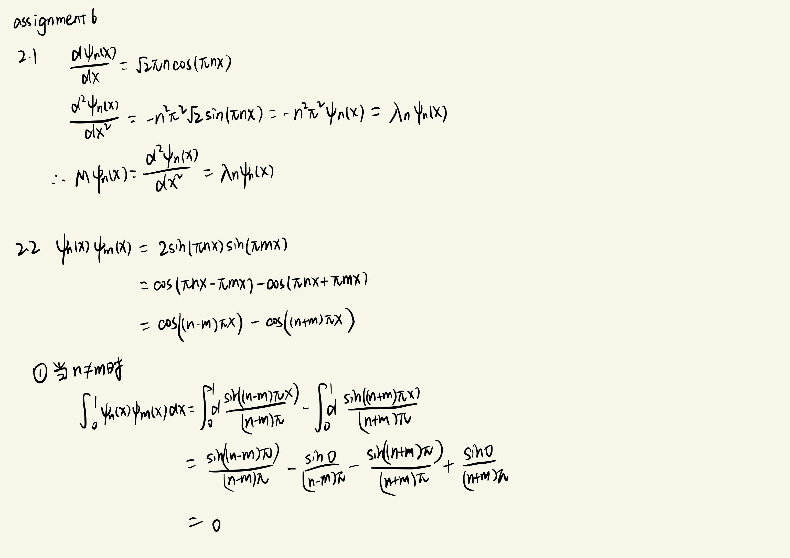
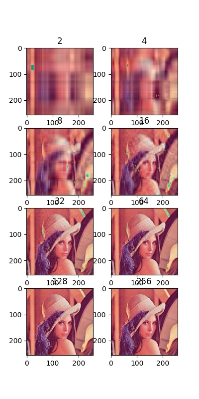
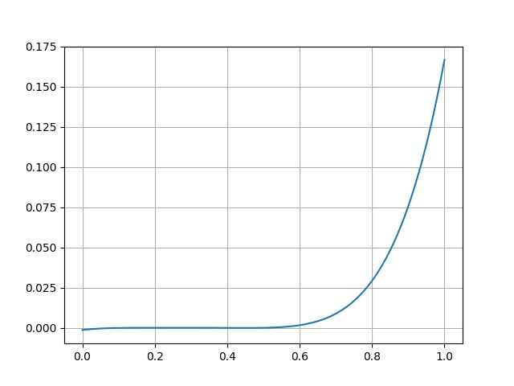

# Assignment 6

## 2 Eigenvectors
### 2.1 
### 2.2


### 2.3 Construct M and $\vec y$ in Python for $y(x) = ψ_1(x)$ and verify that $\vec y$ satisfies the Helmholtz equation 1
```python
    k2y = []
    for xi in x:
        k2y.append(-(np.pi * np.pi) * f(1, xi))

    h2M = []

    for i in range(1, 100):
        for j in range(1, 100):
            if i == j:
                h2M.append(-2 / (0.01 * 0.01))
            elif i - j == 1:
                h2M.append(1 / (0.01 * 0.01))
            elif j - i == 1:
                h2M.append(1 / (0.01 * 0.01))
            else:
                h2M.append(0)

    h2M = np.array([h2M])
    h2M = h2M.reshape(99, 99)

    My = h2M @ y

    bias = []

    for i in range(0, 99):
        bias.append(abs(My[i] - k2y[i]) / (abs(My[i] + k2y[i]) / 2))
```
&emsp;&emsp;k2y = -k * k * y, My=My(x)，bias计算两者之间差的比例，结果bias为e-5，Helmholtz equation成立

### 2.4Use the NumPy function linalg.eig() to find the eigenvectors of the Laplacian, print the 3 eigenvalues with the smallest magnitude, and plot the eigenvectors corresponding to them. The eigenvalues should be close to $−π^2$, $−4π^2$, and $−9π^2$, and the eigenvectors should look like $ψ_1$, $ψ_2$, and $ψ_3$, as you’ve shown in Question 2.1.
```python
    My = np.array(h2M)
    w, v = LA.eig(My)
    print(w)
    print(v)
```

```
w
[-3.99901312e+04 -3.99605346e+04 -3.99112393e+04 -3.98422940e+04
 -3.97537668e+04 -3.96457450e+04 -3.95183352e+04 -3.93716632e+04
 -3.83550925e+04 -3.85955297e+04 -3.88176154e+04 -3.80965410e+04
 -3.90211303e+04 -3.78201305e+04 -3.75261336e+04 -3.72148405e+04
 -3.58031002e+04 -3.61803399e+04 -3.54102649e+04 -3.50022214e+04
 -3.65416115e+04 -3.45793725e+04 -3.41421356e+04 -3.36909421e+04
 -3.92058737e+04 -3.22581411e+04 -3.17557050e+04 -3.12416676e+04
 -3.07165359e+04 -3.27484798e+04 -3.01808283e+04 -2.96350735e+04
 -2.90798100e+04 -2.67747584e+04 -2.73624911e+04 -2.79429578e+04
 -2.61803399e+04 -2.55798221e+04 -2.49737977e+04 -9.86879269e+00
 -3.94654314e+01 -8.87607079e+01 -1.57705974e+02 -2.46233188e+02
 -2.43628648e+04 -3.54254985e+02 -4.81664761e+02 -2.37476263e+04
 -6.28336777e+02 -9.78869674e+02 -1.18238462e+03 -1.40447028e+03
 -1.64490749e+03 -2.12558104e+04 -2.18821663e+04 -2.25066647e+04
 -2.06282152e+04 -1.90345895e+03 -2.00000000e+04 -1.93717848e+04
 -2.17986952e+03 -2.47386640e+03 -1.87441896e+04 -2.78515946e+03
 -1.44201779e+04 -1.50262023e+04 -1.56371352e+04 -1.38196601e+04
 -4.19689975e+03 -4.58973514e+03 -4.99777861e+03 -9.28346410e+03
 -8.75833244e+03 -1.32252416e+04 -8.24429495e+03 -2.31286893e+04
 -9.81917168e+03 -5.85786438e+03 -5.42062745e+03 -1.03649265e+04
 -7.74185893e+03 -6.30905788e+03 -3.45838851e+03 -1.62523737e+04
 -1.81178337e+04 -1.26375089e+04 -1.09201900e+04 -2.85155858e+04
 -3.81966011e+03 -3.32262373e+04 -3.68865585e+04 -7.25152021e+03
 -1.20570422e+04 -1.74933353e+04 -1.68713107e+04 -1.14844142e+04
 -6.77376269e+03 -7.94126286e+02 -3.11344149e+03]
v
[[ 0.00444215 -0.00887992 -0.01330893 ...  0.10608172 -0.0394553
  -0.07577735]
 [-0.00887992  0.0177248   0.02649972 ...  0.14030621 -0.07577735
  -0.12796187]
 [ 0.01330893 -0.02649972 -0.0394553  ...  0.07949059 -0.10608172
  -0.14030621]
 ...
 [ 0.01330893  0.02649972 -0.0394553  ...  0.07949059 -0.10608172
   0.14030621]
 [-0.00887992 -0.0177248   0.02649972 ...  0.14030621 -0.07577735
   0.12796187]
 [ 0.00444215  0.00887992 -0.01330893 ...  0.10608172 -0.0394553
   0.07577735]]
```

## 3 SVD Decomposition
### 3.1 Load the sample image in Appendix A using Python Imaging Library (See details in Appendix B). Compute the singular value decomposition of A using NumPy API linalg.svd()
&emsp;&emsp;导入图片并且reshape为二维进行svd分解,得到$U^T$, $sigma^T$, $V^T$
```
U
 [[-0.06691061 -0.04270999  0.00999434 ... -0.13423311 -0.03855782
  -0.01161056]
 [-0.06690069 -0.04194026  0.01119058 ...  0.23671305  0.05628778
   0.06236199]
 [-0.0666322  -0.0432982   0.00892741 ... -0.08968802 -0.00406826
  -0.14297845]
 ...
 [-0.05972624 -0.05726037 -0.06085826 ... -0.28438974  0.15690609
  -0.05103968]
 [-0.05957524 -0.05789889 -0.05851443 ...  0.21413911 -0.14419019
   0.04941627]
 [-0.05967098 -0.05633809 -0.05623542 ... -0.07586466  0.07239333
  -0.01846036]]
Sigma
 [6.01119822e+04 8.62183380e+03 6.93615422e+03 5.52456714e+03
 5.04798646e+03 4.77036058e+03 3.87778407e+03 3.37613850e+03
 2.76927758e+03 2.67735747e+03 2.20997341e+03 2.06090751e+03
 1.99784407e+03 1.96400213e+03 1.91638380e+03 1.82005953e+03
 1.72191899e+03 1.61075104e+03 1.47658278e+03 1.47191416e+03
 1.38763190e+03 1.35692350e+03 1.21646638e+03 1.15603147e+03
 1.12703095e+03 1.10236569e+03 1.05510760e+03 1.03036825e+03
 9.82113877e+02 9.48294081e+02 9.20233183e+02 9.09030583e+02
 8.92468263e+02 8.75495491e+02 8.47001825e+02 8.45449720e+02
 8.02221226e+02 7.92096089e+02 7.81236960e+02 7.55421035e+02
 7.39403257e+02 7.26992406e+02 7.10693007e+02 6.87963297e+02
 6.63970405e+02 6.53727115e+02 6.33107397e+02 6.17712633e+02
 6.05763439e+02 5.98671859e+02 5.81066099e+02 5.73261355e+02
 5.69142585e+02 5.40084616e+02 5.30401412e+02 5.26674023e+02
 5.17389857e+02 5.04205751e+02 4.95876834e+02 4.77108763e+02
 4.76329361e+02 4.73468647e+02 4.56690575e+02 4.54069741e+02
 4.44446683e+02 4.33753169e+02 4.25199547e+02 4.19386322e+02
 4.07625153e+02 3.95670334e+02 3.88870099e+02 3.83824764e+02
 3.76175396e+02 3.67809629e+02 3.55308562e+02 3.53038230e+02
 3.44661268e+02 3.38824454e+02 3.34721372e+02 3.33409021e+02
 3.25672661e+02 3.24289903e+02 3.13248981e+02 3.08377243e+02
 3.04090036e+02 2.97098574e+02 2.90822872e+02 2.85824731e+02
 2.81745150e+02 2.81407253e+02 2.73844569e+02 2.67483348e+02
 2.62865071e+02 2.57744848e+02 2.54725356e+02 2.50532722e+02
 2.46976211e+02 2.40910722e+02 2.37828849e+02 2.31012901e+02
 2.27752086e+02 2.23720672e+02 2.20518534e+02 2.14684765e+02
 2.09318549e+02 2.07595672e+02 2.05517911e+02 2.01174242e+02
 1.97872555e+02 1.94569301e+02 1.87943694e+02 1.85168415e+02
 1.82258732e+02 1.80414907e+02 1.76979022e+02 1.75858991e+02
 1.71478065e+02 1.67292561e+02 1.64947957e+02 1.58835695e+02
 1.57049912e+02 1.55816060e+02 1.52109749e+02 1.51980284e+02
 1.47489288e+02 1.45257395e+02 1.43600348e+02 1.40645322e+02
 1.39276325e+02 1.35901786e+02 1.34444702e+02 1.30272393e+02
 1.27589419e+02 1.24082488e+02 1.20751640e+02 1.20421816e+02
 1.19053095e+02 1.16411626e+02 1.13717393e+02 1.09941119e+02
 1.07268964e+02 1.06660683e+02 1.04032867e+02 1.03668745e+02
 1.00164593e+02 9.83328949e+01 9.65563901e+01 9.57389381e+01
 9.45742414e+01 9.17500607e+01 9.08709565e+01 8.98552038e+01
 8.65024821e+01 8.53046547e+01 8.40243956e+01 8.29505987e+01
 8.22978062e+01 7.93896722e+01 7.66036396e+01 7.51462469e+01
 7.36088583e+01 6.96768247e+01 6.85966523e+01 6.76210569e+01
 6.59260687e+01 6.39713847e+01 6.26235224e+01 6.19880314e+01
 6.02846064e+01 6.00849243e+01 5.81498601e+01 5.70682619e+01
 5.47515580e+01 5.44518410e+01 5.37932914e+01 5.27207016e+01
 5.14477450e+01 5.02199917e+01 4.99984813e+01 4.95520116e+01
 4.77869730e+01 4.62652731e+01 4.54062526e+01 4.42585522e+01
 4.38665126e+01 4.18457561e+01 4.08696189e+01 4.07554791e+01
 3.91661230e+01 3.85546186e+01 3.84183469e+01 3.66210082e+01
 3.60190953e+01 3.50927433e+01 3.45834256e+01 3.26869844e+01
 3.22387944e+01 3.15095945e+01 3.10310118e+01 3.02486372e+01
 2.94473796e+01 2.93645735e+01 2.83918086e+01 2.76927264e+01
 2.71699315e+01 2.69217254e+01 2.61001444e+01 2.57159481e+01
 2.48334764e+01 2.40983877e+01 2.35567207e+01 2.28066968e+01
 2.24606577e+01 2.23020294e+01 2.17704283e+01 2.11110452e+01
 1.99696588e+01 1.96027130e+01 1.93056370e+01 1.89221125e+01
 1.83506958e+01 1.80508592e+01 1.78642936e+01 1.72651689e+01
 1.71073171e+01 1.69072126e+01 1.62827076e+01 1.62018520e+01
 1.57676525e+01 1.51109969e+01 1.50108118e+01 1.46818132e+01
 1.44280330e+01 1.41952342e+01 1.40146390e+01 1.36674093e+01
 1.33354471e+01 1.31160684e+01 1.30110355e+01 1.27178448e+01
 1.22462204e+01 1.21023893e+01 1.19341537e+01 1.13359779e+01
 1.11288462e+01 1.09641352e+01 1.08219803e+01 1.07619026e+01
 1.04699683e+01 1.03260561e+01 1.01187627e+01 9.81390946e+00
 9.68029925e+00 9.29497681e+00 8.75619083e+00 8.28706076e+00]
VT
 [[-0.04186171 -0.01783912 -0.0215387  ... -0.0476742  -0.02933089
  -0.02932481]
 [-0.02979761 -0.03130787 -0.00927607 ...  0.05654552  0.07095673
   0.04326728]
 [ 0.03779708  0.01714753  0.00181059 ...  0.06578285  0.08259703
   0.0419853 ]
 ...
 [-0.03155086  0.22660142 -0.3361001  ...  0.58477871 -0.28612326
  -0.1469449 ]
 [-0.01683613  0.16091208 -0.25576413 ... -0.27720283  0.64176005
  -0.19747701]
 [-0.01073147 -0.07995006  0.00896845 ... -0.11670851 -0.1895536
   0.52563262]] 
```

### 3.2  For k = 2, 4, 8, 16, 32, 64, 128, p, construct $A_k$ and display the corresponding (approximate) image; you will need to report the rank k in the title of the corresponding figure. Organize your images in a 4 × 2 grid in document
```python
def reconstruct(k):
    A = np.zeros((256, 256* 3))
    for i in range(0, k):
        Ui = U[:, i].T
        Ui = Ui.reshape(256, 1)
        VTi = VT[i, :].reshape(1, 256 * 3)
        A += Sigma[i] * (Ui.dot(VTi))

    return A

def do3_2():
    fix, ax = plt.subplots(4, 2, figsize=(4, 8))

    k = 1
    for i in range(0, 4):
        for j in range(0, 2):
            k = k * 2
            img_reconstruct = reconstruct(k)
            img_reconstruct = img_reconstruct.reshape(256, 256, 3)

            ax[i][j].imshow(img_reconstruct.astype(np.uint8))
            ax[i][j].set(title=str(k))
    plt.show()
```
&emsp;&emsp;取前k个sigma值重构，并且把2,4,8，……，256带入k，得到8张重构图像


### 3.3 Make a plot of singular values of A to see how the size of singular values drop at those point (this gives you an idea of for what k, $A_k$ is a reasonably close approximation to A)
&emsp;&emsp;sigma一直在减少，即最前面的sigma最重要，后面的sigma只是不断完善图片，可以根据3.2的图片看出k较小时，还是能看出大概轮廓，k越大越精细，但到后面sigma太小了，变化已经不大了。取到32,64左右的时候就和原图很相近了。

## 4 Nonlinear System
### 4.1 Make a plot of the polynomial on the interval [0, 1]. How many unique roots are there?

&emsp;&emsp;无法直接看出有多少个根

### 4.2 Search the root using Newton’s method with the initial guess $x_0$ = 0.45. What is the root of the polynomial at least 10 digits of accuracy?
```python
def Newton(x0):
    flag = 1
    x_curr = x0
    x_next = x0
    while flag == 1:
        x_next = x_curr - f(x_curr) / df(x_curr)
        if int(x_next * (10 ** 10)) == int(x_curr * (10 ** 10)):
            flag = 0
        x_curr = x_next

    return x_curr
```
&emsp;&emsp;牛顿法
```
Newton
 0.16666666666666788
```

### 4.3 Search the root using Secant method with the initial guess $x_0$ = 0.45 and $x_{−1}$ = 0. What is the root at least 10 digits of accuracy? Is it same with the Newton’s method?
```python
def Secant(x_1, x0):
    flag = 1
    xa = x_1
    xb = x0

    root_cur = xa - f(xa) * (xb - xa) / (f(xb) - f(xa))
    if f(xa) * f(root_cur) < 0:
        xb = root_cur
    if f(xb) * f(root_cur) < 0:
        xa = root_cur
    root_pre = root_cur

    while flag == 1:
        root_cur = xa - f(xa) * (xb - xa) / (f(xb) - f(xa))

        if int(root_pre * (10 ** 10)) == int(root_cur * (10 ** 10)):
            flag = 0

        if f(xa) * f(root_cur) < 0:
            xb = root_cur
        if f(xb) * f(root_cur) < 0:
            xa = root_cur

        root_pre = root_cur

    return root_cur
```
&emsp;&emsp;f(0)和f(0.45)都是负数，弦截法能解一正一负的区间的根，在这个区间里解不了，我取了0和0.18
```
Secant
 0.16666667140303867
x=0
 -0.001388888888888889
x=0.18
 9.159111111110233e-07
```
&emsp;&emsp;跟牛顿法的结果基本一致